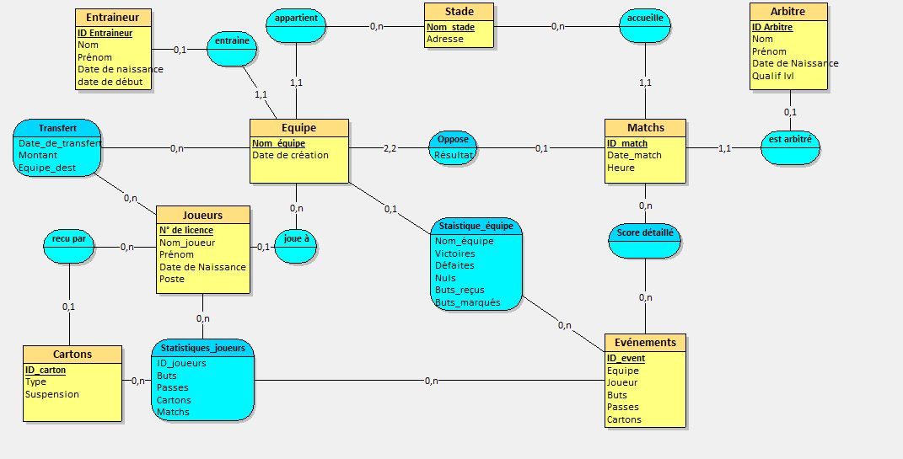
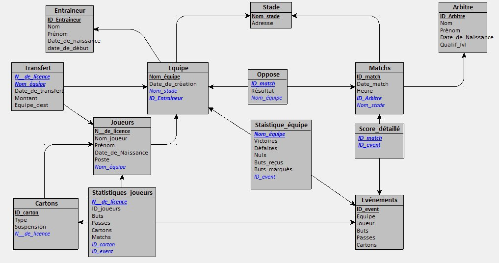

# ⚽ Gestion de Ligue de Football

**Projet L2 — Bases de Données 1**  
**Université de Poitiers — 2024-2025**  
**Auteurs :** SAIFEDDINE Abdellah & EL BASBASSI Alae Eddine

---

## 📌 Description

Application de gestion complète d'une ligue de football, conçue avec **Microsoft Access**.  
Le système centralise et organise les informations relatives aux joueurs, équipes, matchs, arbitres,
entraîneurs, stades, statistiques, cartons et transferts.  
Il offre également des requêtes d'analyse et des formulaires interactifs pour les gestionnaires et supporteurs.

---

## 📁 Structure du projet

```
Ligue_Football/
├── README.md
├── database/
│   └── ligue_football.accdb        # Base de données Microsoft Access
├── docs/
│   ├── rapport_final.pdf           # Rapport complet (Jalon 2)
│   ├── jalon1.pdf                  # Rapport intermédiaire (Jalon 1)
│   ├── jalon2.pdf                  # Consignes Jalon 2
│   └── sujet.pdf                   # Sujet original
└── schemas/
    ├── SEA_final.png               # Schéma Entité-Association final
    └── schema_relationnel.png      # Schéma Relationnel final
```

---

## 🗄️ Tables de la base de données

| Table | Description |
|---|---|
| `Arbitre` | Arbitres de la ligue (nom, prénom, qualification) |
| `Entraîneur` | Entraîneurs des équipes |
| `Equipe` | Équipes de la ligue |
| `Stades` | Stades et leurs adresses |
| `Joueurs` | Joueurs avec leur poste et équipe actuelle |
| `Matchs` | Matchs (date, heure, stade, arbitre) |
| `Oppose` | Relation match ↔ équipes avec résultat |
| `Evénements` | Buts, passes, cartons par joueur par match |
| `Score_détaillé` | Score par équipe par match |
| `Cartons` | Cartons jaunes/rouges et suspensions |
| `Statistique_Joueur` | Buts, passes, cartons, matchs joués |
| `Statistique_Equipe` | Victoires, défaites, nuls, buts marqués/reçus |
| `Transfert` | Historique des transferts (date, montant, destination) |

---

## 🔍 Requêtes disponibles

- **Arbitre du Match** — liste des matchs arbitrés par un arbitre donné
- **Buteurs** — classement des meilleurs buteurs de la ligue
- **Classement** — classement des équipes (points + différence de buts)
- **Historique Confrontation** — résultats des face-à-face entre deux équipes
- **Matches Date** — calendrier des matchs pour une date donnée
- **Nombre de Cartes** — joueurs ayant reçu le plus de cartons
- **Suspendus** — joueurs actuellement suspendus
- **Transfert Joueurs** — historique des transferts d'un joueur

---

## 📋 Formulaires

`Arbitre` · `Calendrier` · `Entraîneur` · `Équipe` · `Événements` · `Joueurs` · `Matches` · `Transfert`

---

## 📊 Schémas

**Schéma Entité-Association (SEA) :**



**Schéma Relationnel :**



---

## ⚠️ Fonctionnalités manquantes

- **Gestion des blessures** — non implémentée (table `Blessures` envisagée)
- **Gestion des saisons** — non implémentée (table `Saisons` envisagée)
- **Liaison cartons ↔ formulaires** — liaison directe non finalisée

---

## 👥 Répartition du travail

| Tâche | SAIFEDDINE Abdellah | EL BASBASSI Alae Eddine |
|---|---|---|
| Schéma Entité-Association | ✅ | |
| Schéma Relationnel | ✅ | |
| Contraintes d'intégrité | ✅ | |
| Description & attributs des tables | ✅ | |
| Remplissage des tables (Access) | ✅ | |
| Création des requêtes (Access) | ✅ | |
| Création des formulaires (Access) | ✅ | |
| Tests requêtes & formulaires | ✅ | |
| Fonctionnalités manquantes & bugs | ✅ | |
| Mise en forme du SEA | | ✅ |
| Page de garde & introduction | | ✅ |
| Mise en forme du rapport | | ✅ |
| Relecture du rapport | | ✅ |

---

## 🛠️ Prérequis

- **Microsoft Access** (>= 2016) pour ouvrir le fichier `.accdb`
